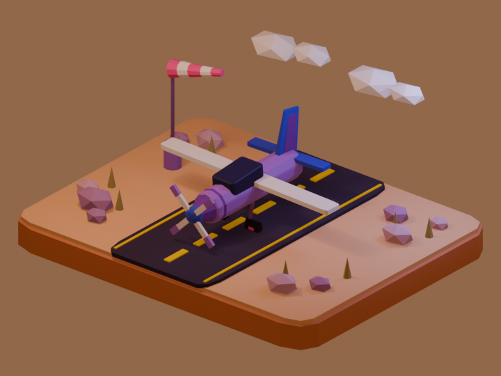

# Blender Replay

Blender Replay records Blender operators, selection/mode context, object and scene changes, materials, and mesh geometry checkpoints. On replay, it runs the original operators and repairs recorded state only when the result diverges.

The extension targets Blender 5.2 and remains compatible with Blender 4.2 LTS and newer.

## Why this exists

Blender exposes most commands as `bpy.ops` operators, but it does not expose a global Python callback containing every UI action. Operator-only recorders therefore miss important modeling context: selected vertices, edges, faces, active elements, modes, and direct RNA property edits. A transform can be captured perfectly while still acting on the wrong face during replay.

Blender Replay uses five capture layers:

1. Completed operators and all serializable RNA properties from `WindowManager.operators`.
2. Active object, mode, object selection, mesh component selection, and bone selection.
3. Object transforms, visibility, parenting, and modifier values after dependency-graph changes.
4. Material nodes, material slots, cameras, lights, world settings, and render/view settings.
5. Optional mesh checkpoints containing coordinates, edges, faces, selection, material indices, and smoothing.

This is broader than an operator macro, but “every Blender action” is not literally possible from a Python extension. View navigation, modal mouse motion, sculpt/paint strokes, simulation caches, arbitrary add-on internals, and some editor-only state may not be reconstructable. Blender Replay records the resulting supported state where possible and reports skipped checkpoints.

## Install

Build the extension with Blender 5.2:

```sh
blender --command extension build \
  --source-dir /path/to/blender-replay \
  --output-dir /path/to/blender-replay/dist
```

In Blender, open **Edit → Preferences → Get Extensions**, use the menu in the top-right, choose **Install from Disk**, and select `blender_replay-0.2.0.zip`.

Open **3D Viewport → Sidebar (`N`) → Replay**.

Prebuilt packages are available from [GitHub Releases](https://github.com/sabetAI/blender-replay/releases/latest).

## Use

1. Set a recording name and press **Start Recording**.
2. Model normally. Use **Capture State Now** after an operation from an unusual add-on if you want an explicit checkpoint.
3. Press **Stop**.
4. Use **Restore Baseline + Replay** for the most deterministic replay. This removes objects created after recording started, so Blender Replay asks for confirmation.
5. Use **Replay Here** when the recording is meant to operate on the current selection instead.

Recordings are saved as hidden Blender text data-blocks and can be exported as human-readable `.chronicle.json` files. Import never evaluates Python source. File-opening, factory-reset, quit, and arbitrary Python-file operators are blocked during replay.

## Verified replay demo



The included airport verification records 65 simulated UI operators that construct 68 objects. Restoring the baseline and replaying produces the same scene digest and a pixel-identical render, with no warnings or geometry repairs. The full metrics are in [`verification_report.json`](verification/airport_scene/verification_report.json).

## Existing alternatives checked in July 2026

- [ActionRecorder](https://github.com/InamuraJIN/ActionRecorder) is free and received Blender 5.0 compatibility work in February 2026. It remains centered on captured operators and commands.
- [SMS Macros V2](https://docs.smartiststudios.co.za/sms_macros/about.html) records operators, right-clicked properties, assets, and Info-editor entries. It is the strongest maintained off-the-shelf option found.
- [Macro Mimic](https://www.patreon.com/posts/macro-mimic-151019007) 0.0.3 is a low-cost experimental recorder whose author still recommends Info-editor copy/paste for heavy scenes.
- [M.A.C.R.O.](https://superhivemarket.com/products/macro) targets Blender 5.1, but its own product page excludes physics simulations and scene settings.

If right-click-to-add property macros are enough, try SMS Macros V2 before adopting custom code. Blender Replay is aimed at modeling sequences where selection and topology fidelity matter.

## Development

Pure Python tests:

```sh
python -m unittest discover -s tests
```

Blender integration test:

```sh
blender --background --factory-startup --python scripts/test_blender.py
```

Live UI operator-capture test:

```sh
blender --factory-startup --enable-event-simulate --python scripts/test_ui_capture.py
```

End-to-end airport scene build, record, replay, and render comparison:

```sh
blender --factory-startup --enable-event-simulate --python scripts/verify_airport_scene.py
```

Validate the extension manifest:

```sh
blender --command extension validate .
```

## License

GPL-3.0-or-later, matching Blender extension requirements.
